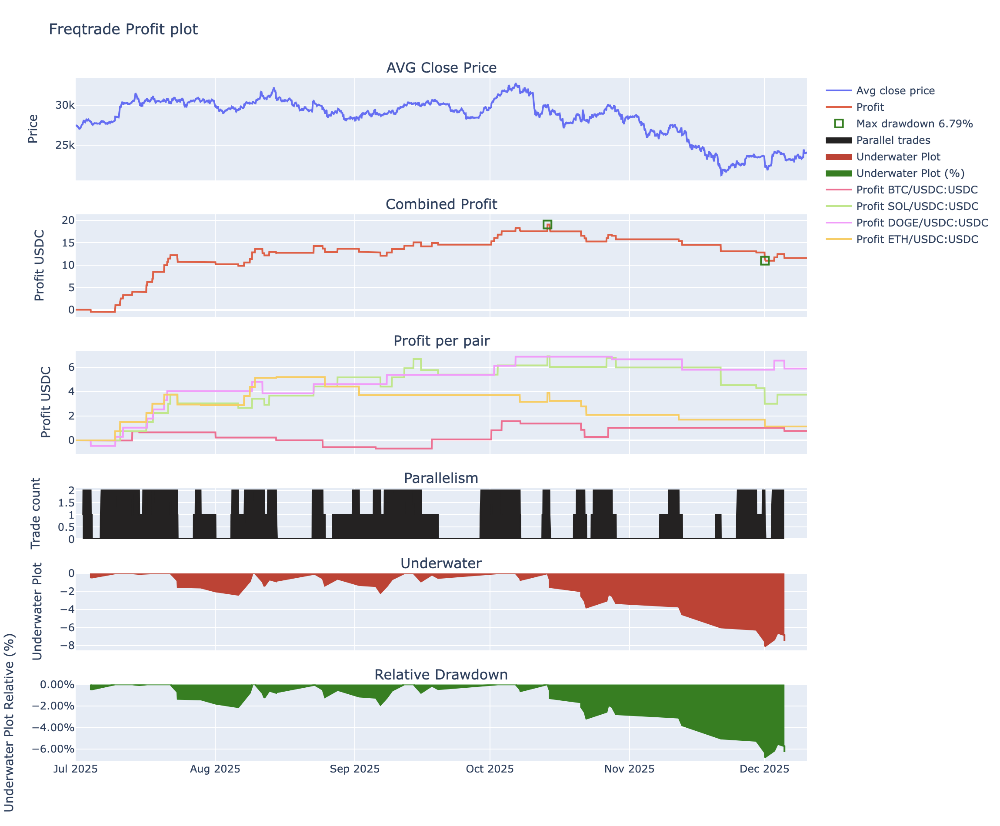
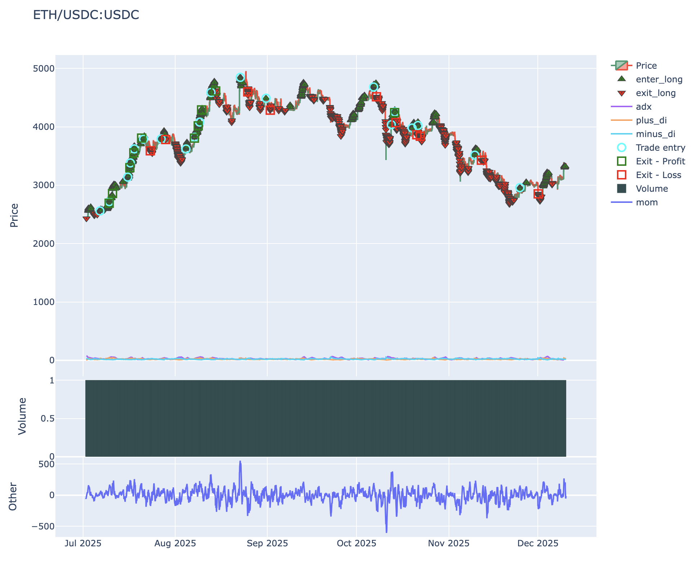

# GMX Freqtrade and CCXT integration tutorial

This example repository shows how to use [CCXT](https://tradingstrategy.ai/glossary/ccxt)-compatible exchange adapter for [GMX](https://tradingstrategy.ai/glossary/gmx),
a decentralised [perpetual futures](https://tradingstrategy.ai/glossary/gmx) exchange. The adapter is provided by [eth_defi](https://github.com/tradingstrategy-ai/web3-ethereum-defi#make) Python package,
which provides necessary low-level primitives for RPC, smart contract interaction, onchain data ignestion and other.

The CCXT-compatible adapter is used with [FreqTrade](https://tradingstrategy.ai/glossary/freqtrade), an [algorithmic trading framework](https://tradingstrategy.ai/glossary/algorithmic-trading) for [Python](https://tradingstrategy.ai/glossary/python) to run an example automated trading strategy on GMX.

**Note**: This is still work-in-progress development. If you intend to use this software check Support section first.

**Note**: As the writing of this, because of GMX's internal limitations, there might not be enough historical data available from GMX historical data REST API endpoint
to perform meaningful trading or backtesting, as the APIs are limited to 10,000 latest candles only.

## Key features

- **CCXT-compatible interface** to GMX's on-chain data
- **Historical backtesting** of GMX perpetual strategies
- **Freqtrade integration** via transparent monkeypatch
- **Real market data** from GMX's liquidity pools
- **Multiple timeframes** (1m, 5m, 15m, 1h, 4h, 1d)
- **Funding rate analysis** and position tracking

## Why GMX?

GMX's unique [AMM](https://tradingstrategy.ai/glossary/amm) offers benefits for traders

- Deep liquidity
- Self custodial, transparent, less conterparty risk
- Pure onchain, composable with DeFi strategies and smart contracts
- Onchain data and execution availability ensures robust, self-hosted, API access

**Note**: Currently GMX APIs does not expose volume (fills) and it is set by zero by the CCXT adapter

## Prerequisites

- **Python 3.11+** (not tested with other Python versions)
- **Git**: for cloning and submodule management
- **10GB+ disk space**: historical data, a lot of code to check out
- **System dependencies**: for talib - see below
- **Basic UNIX command line knowledge**

Microsoft Windows users need to use Windows Subsystem for Linux (WSL).

### Included example trading strategies

This example repository comes with few example strategies for FreqTrade.

- [ADX Momentum](./configs/adxmomentum_gmx.json): Multi-indicator trend following: a basic multi-pair strategy to make modest profit in trending cryptocurrency markets
- [Ping pong](./configs/pingpong_gmx.json): Live entry/exit stress testing (1m timeframe): to check that live trading with the connector works and exchange works
- [RSI simple](./configs/simple_gmx.json): RSI-based momentum strategy

See [Python source code](./user_data/strategies/) for strategies.

All strategies come with

- Python source code for the strategy itself
- Config file for executing against GMX and Hyperliquid to review the adapter functionality side-by-side with a mature CCXT connector
- Example secrets config file

If you want to start building a real trading strategy, ADX momemntum is the best starting point.

### System Dependencies

**Debian/Ubuntu:**

```bash
# Update repository
sudo apt-get update

# Install packages
sudo apt install -y python3-pip python3-venv python3-dev python3-pandas git curl
```

**macOS:**

```bash
# Install packages
brew install gettext libomp
```

**For other systems or troubleshooting**, see the [official Freqtrade installation requirements](https://www.freqtrade.io/en/stable/installation/#requirements).

## Installation

**Note**: AS the writing of this, `uv` Python package managers has issues and cannot correctly install packages in this tutorial. As a solution,
do not use `uv` or fix the issues with the package manager yourself.

### Clone

```bash
# Submodules most be includedin the checkout
git clone  --recurse-submodules  https://github.com/tradingstrategy-ai/gmx-ccxt-freqtrade.git
cd gmx-ccxt-freqtrade
git submodule update --remote --merge
```

### Install Freqtrade

We need to install Freqtrade from a local checkout:

```bash
# Clone freqtrade repository
# this naming is very important else python will get confused because the freqtrade command and the directory name would be same
git clone --branch stable https://github.com/freqtrade/freqtrade.git freqtrade-develop

# Create virtual environment in main project directory using uv
python -m venv .venv

# Activate the virtual environment
source .venv/bin/activate  # Linux/macOS

# Install freqtrade dependencies
pip install -r freqtrade-develop/requirements.txt

# Install freqtrade itself (editable mode)
pip install -e freqtrade-develop/
```

### Install CCXT adapter for GMX

The adapter lives in [eth_defi/gmx/ccxt](https://github.com/tradingstrategy-ai/web3-ethereum-defi/tree/master/eth_defi/gmx/ccxt) submodule.
This will add necessary classes to both CCXT and FreqTrade.

The adapter is injected to Python process via [monkey patching](https://en.wikipedia.org/wiki/Monkey_patch). Due to internal Python structure,
we need to use a special wrapper command around `freqtrade` to launch it.

```bash
# Install web3-ethereum-defi from local submodule (includes freqtrade integration).
# TODO: Currently there is an installation issue resolving web3-ethereum-defi dependencies with uv.
python -m pip install -e "deps/web3-ethereum-defi[web3v7,data,ccxt]"
```

Show installed packages:

```bash
pip list|grep -i web3
```

You should see web3-ethereum-defi package which provides CCXT and FreqTrade monkey patches:

```bash
web3                      7.14.0
web3-ethereum-defi        0.35            /Users/moo/code/gmx-ccxt-freqtrade/deps/web3-ethereum-defi
web3-google-hsm           0.1.0
```

### Verify FreqTrade installation

See that we can start `freqtrade` with our GMX monkey patches:

```bash
./freqtrade-gmx --version
````

This should output:

```
Applying GMX monkeypatch to Freqtrade...
Verifying GMX monkeypatch...
  ccxt.async_support.gmx = <class 'eth_defi.gmx.ccxt.async_support.exchange.GMX'>
  Class module: eth_defi.gmx.ccxt.async_support.exchange
  ✓ load_markets is async
GMX support enabled successfully!
Operating System:       macOS-15.6.1-arm64-arm-64bit
Python Version:         Python 3.11.10
CCXT Version:           4.5.20
Freqtrade Version:      freqtrade 2025.11
```

## Backtesting

In this section, we run a strategy backtest to see how FreqTrade strategy would have historically performend on GMX.

**Note**: As the writing of this, because of GMX's internal limitations, there might not be enough historical data available from GMX historical data REST API endpoint
to perform meaningful trading or backtesting, as the APIs are limited to 10,000 latest candles only. Also because of said limitations, this section of the tutorial
may or may not work in the future.

We use [ADX momentum strategy](./configs/adxmomentum_gmx.json) as an example

- Trades majors: BTC, SOL, DOGE, ETH
- Uses 1h timeframe

## Configuration Generation

Helper scripts to generate FreqTrade config files with new Ethereum wallets:

**Generate full config** (recommended):
```bash
python scripts/generate_config.py <config_name>
# Creates: configs/<name>.json and configs/<name>.secrets.json
```

**Generate wallet only**:
```bash
python scripts/generate_priv_key.py <output_file>
# Creates minimal secrets file with new wallet
```

### Setting up empty secrets configuration file

### Download Historical Data

First we need to download a copy of historicalc GMX data we use for the backtesting.
FreqTrade provides a command for this.
This fetches GMX market data from GMX GraphQL endpoint and stores it locally.

```bash
BACKTEST_TIME_RANGE=20250701-20251208

./freqtrade-gmx download-data \
  --config configs/adxmomentum_gmx.json \
  --config configs/secrets.empty.json \
  --exchange gmx \
  --timeframe 1h \
  --timerange $BACKTEST_TIME_RANGE
```

Example output:

```
2025-12-10 12:20:51,030 - freqtrade.data.history.history_utils - INFO - Download history data for "ETH/USDC:USDC", 1h, index and store in /Users/moo/code/gmx-ccxt-freqtrade/user_data/data/gmx. From 2025-12-10T09:00:00 to
2025-12-08T00:00:00
2025-12-10 12:20:51,033 - freqtrade.data.history.history_utils - INFO - Downloaded data for ETH/USDC:USDC with length 0.
Timeframe                 ━━━━━━━━━━━━━━━━━━━━━━━━━━━━━━━━━━━━━ 3/3 100% • 0:00:01 • 0:00:00
Downloading ETH/USDC:USDC ━━━━━━━━━━━━━━━━━━━━━━━━━━━━━━━━━━━━━ 4/4 100% • 0:00:01 • 0:00:00
2025-12-10 12:20:51,111 - eth_defi.gmx.ccxt.async_support.exchange - INFO - Async GMX exchange session closed
```

### Run backtest

```bash
# Backtest the ADX momentum strategy
./freqtrade-gmx backtesting \
  --config configs/adxmomentum_gmx.json \
  --config configs/secrets.empty.json \
  --strategy ADXMomentum \
  --timerange $BACKTEST_TIME_RANGE
```

You should see backtest results with trades, profit, and statistics:

```
                                                  BACKTESTING REPORT
┏━━━━━━━━━━━━━━━━┳━━━━━━━━┳━━━━━━━━━━━━━━┳━━━━━━━━━━━━━━━━━┳━━━━━━━━━━━━━━┳━━━━━━━━━━━━━━━━━━┳━━━━━━━━━━━━━━━━━━━━━━━━┓
┃           Pair ┃ Trades ┃ Avg Profit % ┃ Tot Profit USDC ┃ Tot Profit % ┃     Avg Duration ┃  Win  Draw  Loss  Win% ┃
┡━━━━━━━━━━━━━━━━╇━━━━━━━━╇━━━━━━━━━━━━━━╇━━━━━━━━━━━━━━━━━╇━━━━━━━━━━━━━━╇━━━━━━━━━━━━━━━━━━╇━━━━━━━━━━━━━━━━━━━━━━━━┩
│ DOGE/USDC:USDC │     17 │         2.31 │           5.894 │         5.89 │  1 day, 10:39:00 │   12     0     5  70.6 │
│  SOL/USDC:USDC │     27 │         0.93 │           3.751 │         3.75 │  1 day, 23:00:00 │   16     0    11  59.3 │
│  ETH/USDC:USDC │     20 │         0.38 │           1.143 │         1.14 │  1 day, 18:57:00 │   10     0    10  50.0 │
│  BTC/USDC:USDC │     15 │         0.34 │           0.773 │         0.77 │ 2 days, 22:24:00 │    5     0    10  33.3 │
│          TOTAL │     79 │         0.97 │          11.560 │        11.56 │  1 day, 23:46:00 │   43     0    36  54.4 │
└────────────────┴────────┴──────────────┴─────────────────┴──────────────┴──────────────────┴────────────────────────┘
                                         LEFT OPEN TRADES REPORT
┏━━━━━━━┳━━━━━━━━┳━━━━━━━━━━━━━━┳━━━━━━━━━━━━━━━━━┳━━━━━━━━━━━━━━┳━━━━━━━━━━━━━━┳━━━━━━━━━━━━━━━━━━━━━━━━┓
┃  Pair ┃ Trades ┃ Avg Profit % ┃ Tot Profit USDC ┃ Tot Profit % ┃ Avg Duration ┃  Win  Draw  Loss  Win% ┃
┡━━━━━━━╇━━━━━━━━╇━━━━━━━━━━━━━━╇━━━━━━━━━━━━━━━━━╇━━━━━━━━━━━━━━╇━━━━━━━━━━━━━━╇━━━━━━━━━━━━━━━━━━━━━━━━┩
│ TOTAL │      0 │          0.0 │           0.000 │          0.0 │         0:00 │    0     0     0     0 │
└───────┴────────┴──────────────┴─────────────────┴──────────────┴──────────────┴────────────────────────┘
                                                 ENTER TAG STATS
┏━━━━━━━━━━━┳━━━━━━━━━┳━━━━━━━━━━━━━━┳━━━━━━━━━━━━━━━━━┳━━━━━━━━━━━━━━┳━━━━━━━━━━━━━━━━━┳━━━━━━━━━━━━━━━━━━━━━━━━┓
┃ Enter Tag ┃ Entries ┃ Avg Profit % ┃ Tot Profit USDC ┃ Tot Profit % ┃    Avg Duration ┃  Win  Draw  Loss  Win% ┃
┡━━━━━━━━━━━╇━━━━━━━━━╇━━━━━━━━━━━━━━╇━━━━━━━━━━━━━━━━━╇━━━━━━━━━━━━━━╇━━━━━━━━━━━━━━━━━╇━━━━━━━━━━━━━━━━━━━━━━━━┩
│     OTHER │      79 │         0.97 │          11.560 │        11.56 │ 1 day, 23:46:00 │   43     0    36  54.4 │
│     TOTAL │      79 │         0.97 │          11.560 │        11.56 │ 1 day, 23:46:00 │   43     0    36  54.4 │
└───────────┴─────────┴──────────────┴─────────────────┴──────────────┴─────────────────┴────────────────────────┘
                                                EXIT REASON STATS
┏━━━━━━━━━━━━━┳━━━━━━━┳━━━━━━━━━━━━━━┳━━━━━━━━━━━━━━━━━┳━━━━━━━━━━━━━━┳━━━━━━━━━━━━━━━━━┳━━━━━━━━━━━━━━━━━━━━━━━━┓
┃ Exit Reason ┃ Exits ┃ Avg Profit % ┃ Tot Profit USDC ┃ Tot Profit % ┃    Avg Duration ┃  Win  Draw  Loss  Win% ┃
┡━━━━━━━━━━━━━╇━━━━━━━╇━━━━━━━━━━━━━━╇━━━━━━━━━━━━━━━━━╇━━━━━━━━━━━━━━╇━━━━━━━━━━━━━━━━━╇━━━━━━━━━━━━━━━━━━━━━━━━┩
│         roi │    42 │          5.0 │          31.500 │         31.5 │ 1 day, 20:23:00 │   42     0     0   100 │
│ exit_signal │    37 │        -3.59 │         -19.939 │       -19.94 │ 2 days, 3:36:00 │    1     0    36   2.7 │
│       TOTAL │    79 │         0.97 │          11.560 │        11.56 │ 1 day, 23:46:00 │   43     0    36  54.4 │
└─────────────┴───────┴──────────────┴─────────────────┴──────────────┴─────────────────┴────────────────────────┘
                                                        MIXED TAG STATS
┏━━━━━━━━━━━┳━━━━━━━━━━━━━┳━━━━━━━━┳━━━━━━━━━━━━━━┳━━━━━━━━━━━━━━━━━┳━━━━━━━━━━━━━━┳━━━━━━━━━━━━━━━━━┳━━━━━━━━━━━━━━━━━━━━━━━━┓
┃ Enter Tag ┃ Exit Reason ┃ Trades ┃ Avg Profit % ┃ Tot Profit USDC ┃ Tot Profit % ┃    Avg Duration ┃  Win  Draw  Loss  Win% ┃
┡━━━━━━━━━━━╇━━━━━━━━━━━━━╇━━━━━━━━╇━━━━━━━━━━━━━━╇━━━━━━━━━━━━━━━━━╇━━━━━━━━━━━━━━╇━━━━━━━━━━━━━━━━━╇━━━━━━━━━━━━━━━━━━━━━━━━┩
│           │         roi │     42 │          5.0 │          31.500 │         31.5 │ 1 day, 20:23:00 │   42     0     0   100 │
│           │ exit_signal │     37 │        -3.59 │         -19.939 │       -19.94 │ 2 days, 3:36:00 │    1     0    36   2.7 │
│     TOTAL │             │     79 │         0.97 │          11.560 │        11.56 │ 1 day, 23:46:00 │   43     0    36  54.4 │
└───────────┴─────────────┴────────┴──────────────┴─────────────────┴──────────────┴─────────────────┴────────────────────────┘
                          SUMMARY METRICS
┏━━━━━━━━━━━━━━━━━━━━━━━━━━━━━━━┳━━━━━━━━━━━━━━━━━━━━━━━━━━━━━━━━━┓
┃ Metric                        ┃ Value                           ┃
┡━━━━━━━━━━━━━━━━━━━━━━━━━━━━━━━╇━━━━━━━━━━━━━━━━━━━━━━━━━━━━━━━━━┩
│ Backtesting from              │ 2025-07-01 20:00:00             │
│ Backtesting to                │ 2025-12-08 00:00:00             │
│ Trading Mode                  │ Isolated Futures                │
│ Max open trades               │ 2                               │
│                               │                                 │
│ Total/Daily Avg Trades        │ 79 / 0.5                        │
│ Starting balance              │ 100 USDC                        │
│ Final balance                 │ 111.56 USDC                     │
│ Absolute profit               │ 11.56 USDC                      │
│ Total profit %                │ 11.56%                          │
│ CAGR %                        │ 28.55%                          │
│ Sortino                       │ 4.32                            │
│ Sharpe                        │ 2.04                            │
│ Calmar                        │ 20.46                           │
│ SQN                           │ 1.89                            │
│ Profit factor                 │ 1.58                            │
│ Expectancy (Ratio)            │ 0.15 (0.26)                     │
│ Avg. daily profit             │ 0.073 USDC                      │
│ Avg. stake amount             │ 15 USDC                         │
│ Total trade volume            │ 2384.405 USDC                   │
│                               │                                 │
│ Best Pair                     │ DOGE/USDC:USDC 5.89%            │
│ Worst Pair                    │ BTC/USDC:USDC 0.77%             │
│ Best trade                    │ SOL/USDC:USDC 5.00%             │
│ Worst trade                   │ SOL/USDC:USDC -9.68%            │
│ Best day                      │ 2.25 USDC                       │
│ Worst day                     │ -1.837 USDC                     │
│ Days win/draw/lose            │ 28 / 100 / 27                   │
│ Min/Max/Avg. Duration Winners │ 0d 00:00 / 12d 07:00 / 1d 20:14 │
│ Min/Max/Avg. Duration Losers  │ 0d 10:00 / 9d 12:00 / 2d 03:58  │
│ Max Consecutive Wins / Loss   │ 11 / 8                          │
│ Rejected Entry signals        │ 898                             │
│ Entry/Exit Timeouts           │ 0 / 0                           │
│                               │                                 │
│ Min balance                   │ 99.533 USDC                     │
│ Max balance                   │ 119.053 USDC                    │
│ Max % of account underwater   │ 6.79%                           │
│ Absolute drawdown             │ 8.082 USDC (6.79%)              │
│ Drawdown duration             │ 48 days 07:00:00                │
│ Profit at drawdown start      │ 19.053 USDC                     │
│ Profit at drawdown end        │ 10.971 USDC                     │
│ Drawdown start                │ 2025-10-13 19:00:00             │
│ Drawdown end                  │ 2025-12-01 02:00:00             │
│ Market change                 │ -2.70%                          │
└───────────────────────────────┴─────────────────────────────────┘

Backtested 2025-07-01 20:00:00 -> 2025-12-08 00:00:00 | Max open trades : 2
                                                           STRATEGY SUMMARY
┏━━━━━━━━━━━━━┳━━━━━━━━┳━━━━━━━━━━━━━━┳━━━━━━━━━━━━━━━━━┳━━━━━━━━━━━━━━┳━━━━━━━━━━━━━━━━━┳━━━━━━━━━━━━━━━━━━━━━━━━┳━━━━━━━━━━━━━━━━━━━┓
┃    Strategy ┃ Trades ┃ Avg Profit % ┃ Tot Profit USDC ┃ Tot Profit % ┃    Avg Duration ┃  Win  Draw  Loss  Win% ┃          Drawdown ┃
┡━━━━━━━━━━━━━╇━━━━━━━━╇━━━━━━━━━━━━━━╇━━━━━━━━━━━━━━━━━╇━━━━━━━━━━━━━━╇━━━━━━━━━━━━━━━━━╇━━━━━━━━━━━━━━━━━━━━━━━━╇━━━━━━━━━━━━━━━━━━━┩
│ ADXMomentum │     79 │         0.97 │          11.560 │        11.56 │ 1 day, 23:46:00 │   43     0    36  54.4 │ 8.082 USDC  6.79% │
└─────────────┴────────┴──────────────┴─────────────────┴──────────────┴─────────────────┴────────────────────────┴───────────────────┘
2025-12-10 13:01:36,182 - eth_defi.gmx.ccxt.async_support.exchange - INFO - Async GMX exchange session closed
```

#### Equity curve

You can view the equity curve chart of the backtest results with:

```bash
./freqtrade-gmx plot-profit \
  --config configs/adxmomentum_gmx.json \
  --config configs/secrets.empty.json \
  --auto-open
```



#### Entries and exists

You can view the entries/exits chart of the strategy with.
This will render the chart and open a new browser window to display it:

```bash
./freqtrade-gmx plot-dataframe \
  --config configs/adxmomentum_gmx.json \
  --config configs/secrets.empty.json \
  --strategy ADXMomentum \
  --indicators1 adx plus_di minus_di \
  --indicators2 mom

open user_data/plot/freqtrade-plot-ETH_USDC_USDC-1h.html
```



## Live trading

#### Using the `freqtrade-gmx` wrapper

```sh
./freqtrade-gmx trade --strategy PingpongShort --config configs/pingpong_short_gmx.json --config configs/pingpong_sl_gmx.secrets.json --log-file freqtrade.logs
```

#### Using docker 

```sh
docker compose build --no-cache ichiv2_gmx && docker compose up ichiv2_gmx
```

**N.B.** Make sure for better stability use private RPCs & update the `.secrects.json` file and add them there. You can pass multiple RPCs like this 


```json
  ...
  "rpcUrl": "https://rpc1.com https://rpc2.com"  
  ...
```


## Fees

The trading fee to open a position is [`0.04%` or `0.06%`](https://docs.gmx.io/docs/trading#fees-and-rebates) of the position size, similarly there is a 0.04% or 0.06% fee when closing the position. This applies for increasing the position size of an existing position and partially decreasing a position size as well.

If the trade increases the balance of longs and shorts then the fee would be 0.04%, otherwise the fee would be 0.06%.

**N.B.** On top of this fees you have to pay keeper fees as well so that your trades are executed by keepers otherwise you would end up losing gas. This is where the [`executionBuffer`](configs/adxmomentum_gmx.json) option comes in handy. You can adjust how much fees you want to pay the keepers. From our testing we have found that if we `executionBuffer` to `2.5` as of 09.02.2026 the trades goes through and which is significantly less than the fees that we pay from GMX web UI. Anything less than that may and will cause issues. If you set the values between `1.5-1.9` you maybe able to send 1 or 2 orders but that is also very rare. What we have seen is that for each type of order the keeper fee is roughly `0.42-0.48`$. 

## About the monkey patch

The monkeypatch (`python -m eth_defi.gmx.freqtrade.patched_entrypoint`):

- Adds `ccxt.gmx` and `ccxt.async_support.gmx` classes
- Registers GMX in Freqtrade's `SUPPORTED_EXCHANGES`
- Provides CCXT-compatible interface to GMX's on-chain data
- No modifications to Freqtrade or CCXT source code

See [docs/architecture.md](docs/architecture.md) for technical details.

## Support

- [Join Discord for any questions](https://tradingstrategy.ai/community).

## Social media

- [Follow on Twitter](https://twitter.com/TradingProtocol)
- [Follow on Telegram](https://t.me/trading_protocol)
- [Follow on LinkedIn](https://www.linkedin.com/company/trading-strategy/)
- [Watch tutorials on YouTube](https://www.youtube.com/@tradingstrategyprotocol)

## License

MIT.

[Created by Trading Strategy](https://tradingstrategy.ai).
