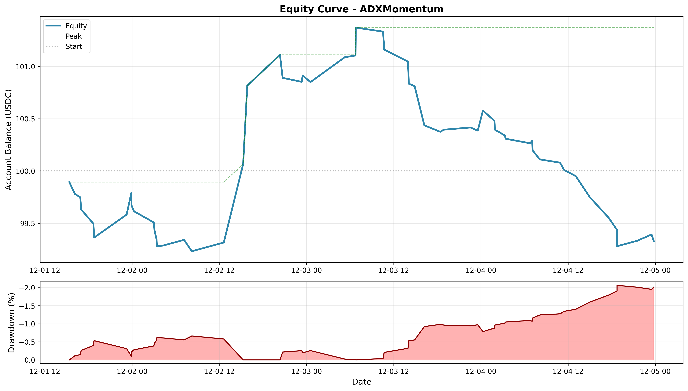

# Generating Equity Curves

Equity curves visualize your account balance over time during backtests, helping you understand drawdowns, volatility, and overall performance trajectory.

## Table of Contents

- [Custom Python Scripts](#custom-python-scripts)

## Custom Python Scripts

For more control, create custom equity curve plots using the backtest results JSON.

### Read Backtest Results

```python
import json
import pandas as pd
import matplotlib.pyplot as plt
from pathlib import Path

# Load backtest results
with open('user_data/backtest_results/backtest-result-YYYY-MM-DD_HH-MM-SS.json') as f:
    results = json.load(f)

# Handle multi-strategy format
if 'strategy' in results:
    strategy_name = list(results['strategy'].keys())[0]
    results = results['strategy'][strategy_name]

# Extract trades
trades_df = pd.DataFrame(results['trades'])

# Convert timestamps
trades_df['close_date'] = pd.to_datetime(trades_df['close_date'])

print(f"Total trades: {len(trades_df)}")
print(f"Starting balance: {results['starting_balance']}")
```

### Create Equity Curve

```python
# Sort and calculate cumulative profit
trades_df = trades_df.sort_values('close_date')
starting_balance = results['starting_balance']
trades_df['cumulative_profit'] = trades_df['profit_abs'].cumsum()
trades_df['equity'] = starting_balance + trades_df['cumulative_profit']

# Plot equity curve
plt.figure(figsize=(12, 6))
plt.plot(trades_df['close_date'], trades_df['equity'], linewidth=2.5, color='#2E86AB')
plt.axhline(y=starting_balance, color='gray', linestyle=':', alpha=0.5, label='Start')
plt.xlabel('Date')
plt.ylabel('Account Balance (USDC)')
plt.title(f'Equity Curve - {results.get("strategy_name", "Unknown")}')
plt.legend()
plt.grid(True, alpha=0.3)
plt.tight_layout()
plt.savefig('equity_curve.png', dpi=300, bbox_inches='tight')
plt.show()

# Print stats
final_equity = trades_df['equity'].iloc[-1]
total_profit = final_equity - starting_balance
total_return = (total_profit / starting_balance) * 100
print(f"Final equity: ${final_equity:,.2f}")
print(f"Total profit: ${total_profit:,.2f}")
print(f"Total return: {total_return:.2f}%")
```

### Add Drawdown Visualization

```python
# Calculate drawdown
trades_df['peak_equity'] = trades_df['equity'].cummax()
trades_df['drawdown_pct'] = ((trades_df['equity'] - trades_df['peak_equity'])
                              / trades_df['peak_equity'] * 100)

# Create figure with two subplots
fig, (ax1, ax2) = plt.subplots(2, 1, figsize=(14, 8),
                                 gridspec_kw={'height_ratios': [3, 1]})

# Equity curve
ax1.plot(trades_df['close_date'], trades_df['equity'],
         linewidth=2.5, color='#2E86AB', label='Equity')
ax1.plot(trades_df['close_date'], trades_df['peak_equity'],
         linewidth=1, linestyle='--', color='green', alpha=0.5, label='Peak')
ax1.axhline(y=starting_balance, color='gray', linestyle=':',
            alpha=0.5, label='Start')
ax1.set_ylabel('Account Balance (USDC)', fontsize=12)
ax1.set_title(f'Equity Curve - {results.get("strategy_name", "Unknown")}',
              fontsize=14, fontweight='bold')
ax1.legend(loc='upper left')
ax1.grid(True, alpha=0.3)

# Drawdown
ax2.fill_between(trades_df['close_date'], trades_df['drawdown_pct'], 0,
                 color='red', alpha=0.3)
ax2.plot(trades_df['close_date'], trades_df['drawdown_pct'],
         linewidth=1.5, color='darkred')
ax2.set_ylabel('Drawdown (%)', fontsize=12)
ax2.set_xlabel('Date', fontsize=12)
ax2.grid(True, alpha=0.3)
ax2.invert_yaxis()

plt.tight_layout()
plt.savefig('equity_with_drawdown.png', dpi=300, bbox_inches='tight')
plt.show()

# Print stats
max_drawdown = trades_df['drawdown_pct'].min()
print(f"Maximum drawdown: {max_drawdown:.2f}%")
```

### Monthly Returns Heatmap

```python
import seaborn as sns

# Extract month and year
trades_df['year'] = trades_df['close_date'].dt.year
trades_df['month'] = trades_df['close_date'].dt.month

# Calculate monthly returns
monthly_returns = trades_df.groupby(['year', 'month'])['profit_abs'].sum().reset_index()
monthly_returns['return_pct'] = (monthly_returns['profit_abs'] / results['starting_balance']) * 100

# Pivot for heatmap
returns_pivot = monthly_returns.pivot(index='month', columns='year', values='return_pct')

# Plot heatmap
plt.figure(figsize=(10, 6))
sns.heatmap(returns_pivot, annot=True, fmt='.2f', cmap='RdYlGn', center=0,
            cbar_kws={'label': 'Return (%)'})
plt.title('Monthly Returns Heatmap')
plt.ylabel('Month')
plt.xlabel('Year')
plt.tight_layout()
plt.savefig('monthly_returns.png', dpi=300)
plt.show()
```

## Complete Example Script

Create `scripts/plot_equity.py`:

```python
#!/usr/bin/env python3
"""
Generate equity curve from Freqtrade backtest results

Usage:
    python scripts/plot_equity.py user_data/backtest_results/backtest-result-2025-12-08_11-36-37.json
"""

import sys
import json
import pandas as pd
import matplotlib.pyplot as plt
from pathlib import Path

def plot_equity_curve(results_file):
    # Load results
    with open(results_file) as f:
        results = json.load(f)

    # Handle multi-strategy format
    if 'strategy' in results:
        # Multi-strategy format - extract first strategy
        strategy_name = list(results['strategy'].keys())[0]
        results = results['strategy'][strategy_name]

    if not results.get('trades'):
        print("No trades found in results!")
        return

    # Process trades
    trades_df = pd.DataFrame(results['trades'])
    trades_df['close_date'] = pd.to_datetime(trades_df['close_date'])
    trades_df = trades_df.sort_values('close_date')

    # Calculate equity
    starting_balance = results['starting_balance']
    trades_df['cumulative_profit'] = trades_df['profit_abs'].cumsum()
    trades_df['equity'] = starting_balance + trades_df['cumulative_profit']
    trades_df['peak_equity'] = trades_df['equity'].cummax()
    trades_df['drawdown_pct'] = ((trades_df['equity'] - trades_df['peak_equity'])
                                  / trades_df['peak_equity'] * 100)

    # Create figure
    fig, (ax1, ax2) = plt.subplots(2, 1, figsize=(14, 8),
                                     gridspec_kw={'height_ratios': [3, 1]})

    # Equity curve
    ax1.plot(trades_df['close_date'], trades_df['equity'],
             linewidth=2.5, color='#2E86AB', label='Equity')
    ax1.plot(trades_df['close_date'], trades_df['peak_equity'],
             linewidth=1, linestyle='--', color='green', alpha=0.5,
             label='Peak')
    ax1.axhline(y=starting_balance, color='gray', linestyle=':',
                alpha=0.5, label='Start')

    ax1.set_ylabel('Account Balance (USDC)', fontsize=12)
    ax1.set_title(f'Equity Curve - {results.get("strategy_name", "Unknown")}',
                  fontsize=14, fontweight='bold')
    ax1.legend(loc='upper left')
    ax1.grid(True, alpha=0.3)

    # Drawdown
    ax2.fill_between(trades_df['close_date'], trades_df['drawdown_pct'], 0,
                     color='red', alpha=0.3)
    ax2.plot(trades_df['close_date'], trades_df['drawdown_pct'],
             linewidth=1.5, color='darkred')
    ax2.set_ylabel('Drawdown (%)', fontsize=12)
    ax2.set_xlabel('Date', fontsize=12)
    ax2.grid(True, alpha=0.3)
    ax2.invert_yaxis()

    plt.tight_layout()

    # Save
    output_path = Path(results_file).parent / 'equity_curve.png'
    plt.savefig(output_path, dpi=300, bbox_inches='tight')
    print(f"\n✓ Equity curve saved to: {output_path}")

    # Stats
    final_equity = trades_df['equity'].iloc[-1]
    total_profit = final_equity - starting_balance
    total_return = (total_profit / starting_balance) * 100
    max_drawdown = trades_df['drawdown_pct'].min()

    print(f"\n{'='*50}")
    print(f"  Starting Balance:  ${starting_balance:,.2f}")
    print(f"  Final Equity:      ${final_equity:,.2f}")
    print(f"  Total Profit:      ${total_profit:,.2f}")
    print(f"  Total Return:      {total_return:.2f}%")
    print(f"  Max Drawdown:      {max_drawdown:.2f}%")
    print(f"  Total Trades:      {len(trades_df)}")
    print(f"{'='*50}\n")

    plt.show()

if __name__ == '__main__':
    if len(sys.argv) < 2:
        print("Usage: python plot_equity.py <backtest_results.json>")
        sys.exit(1)

    plot_equity_curve(sys.argv[1])
```

Make it executable and use:

```bash
chmod +x scripts/plot_equity.py

# Plot results
python scripts/plot_equity.py user_data/backtest_results/backtest-result-2025-12-08_11-36-37.json
```

**Expected output:**

```
✓ Equity curve saved to: user_data/backtest_results/equity_curve.png

==================================================
  Starting Balance:  $100.00
  Final Equity:      $99.33
  Total Profit:      $-0.67
  Total Return:      -0.67%
  Max Drawdown:      -2.06%
  Total Trades:      59
==================================================
```



## Resources

- [Freqtrade Plotting Documentation](https://www.freqtrade.io/en/stable/plotting/)
- [Matplotlib Documentation](https://matplotlib.org/stable/contents.html)
- [Pandas Time Series](https://pandas.pydata.org/docs/user_guide/timeseries.html)
